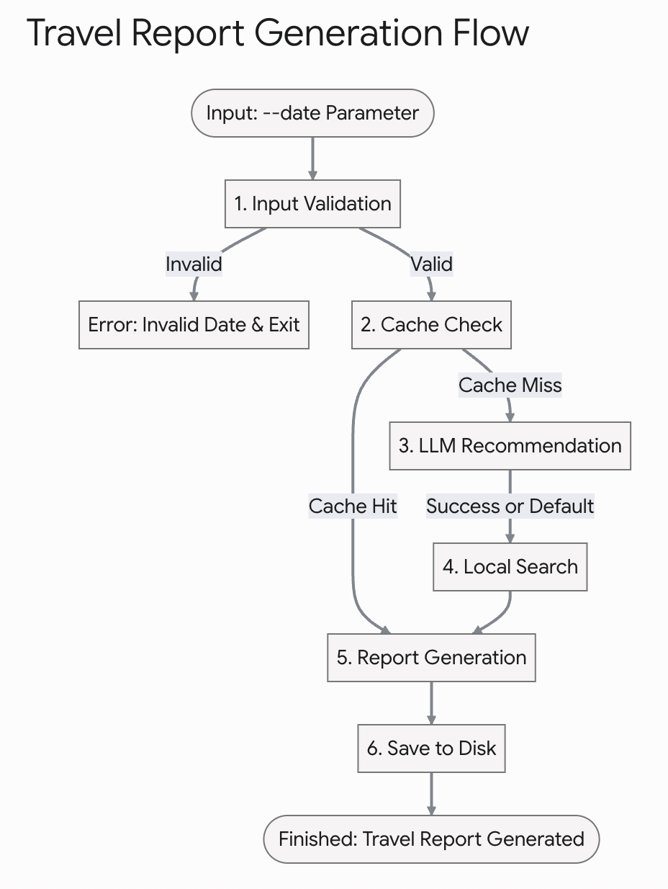

프로젝트 뼈대 구축

A. 프로그램 기본 흐름도




# 🚀 여행 리포트 생성기 구현 가이드

본 문서는 CLI 기반 여행 리포트 생성 프로그램의 단계별 세부 구현 흐름을 정의한 가이드입니다.

## B. 기본 설정 및 흐름 구현

### B-1. CLI 인터페이스 구현 (`argparse`)

- `--date "YYYY-MM-DD"` 옵션 받기
- 날짜 형식 검증
  - └── 잘못된 형식이면 사용법 출력 후 즉시 종료

### B-2. API 키 검증 함수 구현

- `.env`에서 `os.getenv()`로 키 읽기
- 키 미설정 시 → 설정 방법 안내 출력 후 즉시 종료
  - └── macOS/Linux: `export OPENAI_API_KEY="YOUR_KEY"` (또는 GEMINI_API_KEY)
  - └── Windows: `$env:OPENAI_API_KEY="YOUR_KEY"`

### B-3. `main()` 함수 흐름 작성

- `errors = []` ← 오류 목록, 처음부터 빈 리스트로 관리
- `[1/3] 1차 추천` → `[2/3] 맛집 검색` → `[3/3] 리포트 생성`
- 각 함수는 일단 `pass`로 비워두고 흐름만 먼저 연결

### B-4. `results/` 폴더 자동 생성

- `Path("results").mkdir(exist_ok=True)`
- 실행할 때마다 자동으로 생성되도록 처리

## C. LLM API - 1차 추천

### C-1. LLM 클라이언트 초기화

- `api_key = os.getenv("GEMINI_API_KEY")` (또는 OPENAI_API_KEY)
- 클라이언트 객체 생성 (예: `genai.Client(api_key=api_key)`)

### C-2. 프롬프트 설계 (핵심!)

- 날짜를 입력받아 **JSON만 반환하도록** 지시
- 필수 키 4개를 프롬프트에 명시
  - └── `recommended_city` : string (예: "제주") *※ 복수 지역일 경우* `recommended_cities` *배열*
  - └── `weather` : string (해당 시기 날씨 요약)
  - └── `events` : array (행사/축제 1~3개)
  - └── `reason` : string (추천 근거 2~4문장)
- "반드시 JSON만 출력하고 다른 텍스트는 쓰지 마세요" 명시

### C-3. API 호출 및 응답 받기

- 모델 생성 API 호출 (예: `client.models.generate_content()`)
- 응답 결과에서 텍스트(JSON 문자열) 추출

### C-4. JSON 파싱 + 실패 시 재시도 1회

- **1차 시도**: `json.loads()`
- **파싱 실패 시** → 프롬프트 수정("필수 키만 JSON으로 출력") 후 재시도
- **재시도도 실패 시** → `errors`에 기록 + 기본값으로 계속 진행
  - └── `{"step": "llm_recommendation", "type": "PARSE_ERROR", "message": "..."}`

## D. 지도 API - 맛집 검색

### D-1. API 인증 헤더 설정 (Naver 예시)

- `client_id = os.getenv("NAVER_CLIENT_ID")`
- `client_secret = os.getenv("NAVER_CLIENT_SECRET")`

### D-2. 검색 요청 보내기

- `url = "https://openapi.naver.com/v1/search/local.json"`
- `params = {"query": f"{도시명} 맛집", "display": 5}`
- `requests.get(url, headers=headers, params=params)`

### D-3. 응답 파싱 (맛집 아이템 최소 필드)

- `name` : 장소명
- `address` : 도로명 주소
- `category` : 카테고리 (가능한 경우)
- `url` : 상세 URL (가능한 경우)
- `x`, `y` : 경도/위도 좌표 (KATEC 등 변환 필요 시 처리)

### D-4. 예외 처리 (3가지 케이스)

- **401/403 에러** → `errors` 기록 + "데이터 없음" 처리 후 계속 진행
  - └── `{"step": "place_search", "type": "AUTH_ERROR", "message": "HTTP 401"}`
- **결과 0건** → `errors` 기록 + 빈 리스트 반환 후 계속 진행
  - └── `{"step": "place_search", "type": "EMPTY_RESULT", "message": "0 results for query=..."}`
- **네트워크 오류** → `errors` 기록 + 빈 리스트 반환 후 계속 진행
  - └── `{"step": "place_search", "type": "NETWORK_ERROR", "message": "..."}`
- **※ 주의**: 어떤 경우에도 프로그램이 중단되지 않아야 함.

## E. LLM API - 리포트 생성

### E-1. 프롬프트 설계

- 1차 추천 JSON + 맛집 목록을 문자열로 변환해서 전달
- "Markdown 형식으로만 출력" 명시
- 맛집이 0건이면 "데이터 없음"으로 표기하도록 지시

### E-2. 리포트 필수 섹션 (Markdown 구조)

```
# YYYY-MM-DD 국내 여행 추천 리포트

## 추천 지역 및 추천 이유
(내용)

## 날씨 요약
(내용)

## 행사 / 축제 목록
(내용)

## 맛집 리스트
└── 0건이면 "- 데이터 없음 (장소 검색 결과 0건)" 표기

## 1일 일정 제안
└── 오전 / 오후 / 저녁 구성

## 오류 요약(errors)
└── errors 리스트가 비어있으면 "- 없음" 표기
└── 있으면 step / type / message 표기

```

### E-3. API 호출 및 응답 받기

- C-3과 동일한 방식으로 호출
- 응답 텍스트를 Markdown 구조 검증 후 그대로 사용

## F. 결과 저장

### F-1. 원본 데이터 JSON 저장

- **파일명**: `results/{date}_raw.json`
- **필수 포함 내용**:
  - └── `recommendation` : 1차 추천 JSON 파싱 결과
  - └── `restaurants` : 맛집 검색 결과 딕셔너리/리스트 (0건 가능)
  - └── `errors` : 오류 요약 리스트 (빈 리스트 가능)

### F-2. 최종 리포트 Markdown 저장

- **파일명**: `results/{date}_report.md`
- **내용**: E단계에서 LLM이 생성한 Markdown 텍스트 그대로 저장

### F-3. 저장 완료 후 경로 안내 출력

- `print(f"✅ 완료! results/{date}_report.md 를 확인하세요.")`

## H. 보너스: 복수 지역 추천

### H-1. LLM 프롬프트 수정

- `recommended_city` (단수) → `recommended_cities` (배열) 로 변경
- 예: `"recommended_cities": ["제주", "강릉", "전주"]`

### H-2. 맛집 검색 루프 처리

- `recommended_cities` 배열을 순회하며 각 도시별 검색
- `for city in recommended_cities: restaurants[city] = search_restaurants(city)`

### H-3. 결과 구조 변경

- `restaurants`가 리스트 → 딕셔너리로 변경
  - └── `{"제주": [...], "강릉": [...], "전주": [...]}`
- `errors`도 도시별로 step에 도시명 포함
  - └── `{"step": "place_search_제주", "type": "EMPTY_RESULT", ...}`

### H-4. 리포트 구조 변경

- 맛집 섹션 및 1일 일정 제안을 도시별로 분리해서 출력 (예: `### 제주`, `### 강릉`)

## I. 보너스: 캐싱

### I-1. 캐시 확인 로직 추가 (`main()` 시작 부분)

- `results/{date}_raw.json` 파일이 이미 존재하는지 확인
- 존재하면 → API 호출 건너뛰고 JSON 파일 읽기
- 존재하지 않으면 → 기존 흐름대로 API 호출

### I-2. 캐시 히트(Hit) 시 처리

- 저장된 JSON에서 `recommendation`, `restaurants`, `errors` 읽기
- `[3/3] 리포트 생성`만 다시 실행 (또는 기존 md도 그대로 사용)
- 로그 출력: `"캐시 발견! API 호출을 건너뜁니다."`

### I-3. 캐시 미스(Miss) 시 처리

- 기존 흐름 그대로 실행 (C → D → E → F)

**[전체 파이프라인 흐름 정리]**

- **캐시 있음**: JSON 읽기 → 리포트 재생성 (또는 기존 md 사용)
- **캐시 없음**: LLM 추천 API 호출 → 지역 검색 API 호출 → JSON 저장 → 리포트 생성 및 저장

